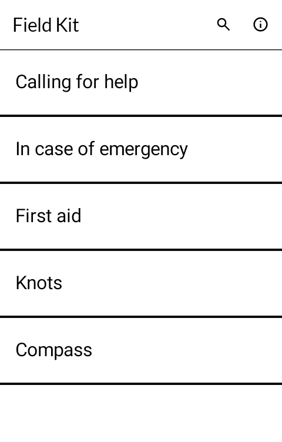
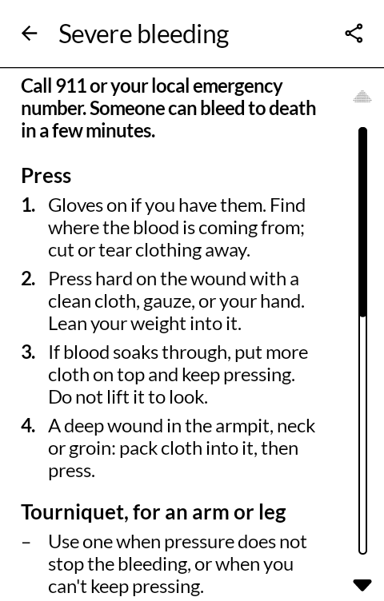
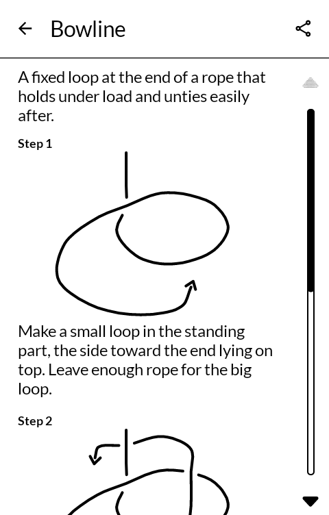
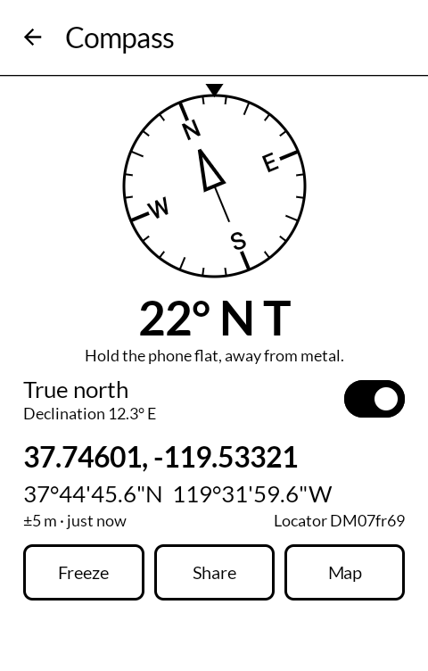

# 雑嚢 zatsunō — Field Kit

First aid, knots and a compass, offline, on one plain home screen. Short first-aid pages you
can read at a glance, a dozen knots drawn step by step, a compass with your position, and an
"In case of emergency" card. Built for the [Mudita Kompakt](https://mudita.com/products/kompakt/),
and it will install on any Android 12 device.

*Zatsunō* is 雑嚢 — the canvas haversack, the bag you carry odds and ends in.

| | |
|---|---|
|  |  |
|  |  |

## What it does

- **Calling for help.** Your position read off the satellites, ready to read out to a
  dispatcher, with how close it is and how old. Share it as text to Messaging or anything else
  (decimal, degrees-minutes-seconds, a `geo:` address and a map link), or open the dialler with
  911 or 112 filled in. What to tell the call-taker, and what to do with no signal.
- **First aid.** Twenty-one short pages: checking the scene and the person, hands-only CPR,
  choking, severe bleeding and tourniquets, shock, anaphylaxis and allergic reactions, head
  injury, fractures, sprains, burns, hypothermia, frostbite, heat illness, lightning, snakebite,
  ticks, wounds, blisters and dehydration. Each is written for this screen from current US
  government guidance and names its sources. Where the advice has changed (tourniquets,
  CPR, choking, snakebite) the page says what changed and who says so.
- **Knots.** Overhand, figure-eight, figure-eight loop, bowline, clove hitch, two half hitches,
  taut-line hitch, sheet bend, square knot, prusik, double fisherman's and timber hitch. What
  each is for in a line, and each step drawn, the rope's working end marked with an arrow and
  over-and-under shown by a gap in the lower strand.
- **Compass.** The heading in degrees and points, magnetic or true north, your position in
  decimal, degrees-minutes-seconds and as a Maidenhead locator, and Freeze to hold the screen
  still while you read or copy it. Open your position in any map app on the phone (Topo
  answers), or share it.
- **In case of emergency.** A card you fill in: name, blood type, allergies, medicines,
  conditions, people to call and a note. Every line is optional. Contacts come from your
  contacts app; medicines can come from Medicine if it is installed. It sits at the top of
  "Calling for help", and on the lock screen through
  [Glance](https://github.com/wanderwildwood/hitome) if you switch that on, with the lines you
  choose.
- **Search across all of it**, and send any page or knot to Notes or anywhere else as text.
  Select text on a page to reach Define and the other text apps.

## What it does not do

- **It does not replace first-aid training, or a call for help.** Every page says so. The pages
  are a reminder for someone who has to act, not a course.
- **No internet.** The app has no internet permission. Location is used only while the compass
  or "Calling for help" is open, and stays on the phone.
- **The emergency card stays on the phone.** It is shown on the lock screen only if you switch
  that on, and then anyone holding the phone can read it without unlocking.
- **True north needs a fix.** The declination depends on where you are, so until there is a
  position the compass offers magnetic only and says so. The declination comes from the
  magnetic model built into Android.

## Where the first-aid pages come from

Each page was written for this app from public-domain US government sources: MedlinePlus and
other NIH pages, the CDC and NIOSH, the National Park Service, the National Weather Service,
DHS's Stop the Bleed material, 911.gov and the FCC. The sources are named at the foot of each
page. The pages live in `app/src/main/res/raw/aid_*.txt` in a small plain-text markup, so a
translation is a copy of that folder (`raw-de/`, `raw-es/` …) and Android picks the reader's
language.

## The compass

The compass and position code comes from [kCompass](https://github.com/ok1cdj/kCompass) by
Ondřej Koloničný, OK1CDJ, under GPL-3.0: the smoothed heading from the rotation sensor, the
position stream from Android's own location service (no Google services, which the Kompakt
does not have), the coordinate formats and the Maidenhead locator, with its tests.

## The knot drawings

Drawn by `tools/make-knots.py`, which writes them as vector drawables. Each knot is one rope
written as a few points it passes through, each marked as over, under or neither; the steps are
that rope cut short. Run it with `--sheet DIR` to get every step as an SVG to look at.

## Opening it from another app

Two intents open Field Kit at a page. Neither needs a permission, and neither changes
anything on the phone; they only choose what the screen shows. Back from that page returns to
the app that opened it. On Android 11 and later the calling app needs
`<package android:name="com.wanderwildwood.zatsuno" />` in its `<queries>` to see that Field
Kit is installed, and should offer the link only when it is.

**A first-aid page:** action `com.wanderwildwood.zatsuno.action.FIRST_AID`, with the page's id
as the string extra `com.wanderwildwood.zatsuno.extra.PAGE`. The ids are `scene`, `call`,
`cpr`, `choking`, `bleeding`, `shock`, `anaphylaxis`, `allergy`, `head`, `fracture`, `sprain`,
`burns`, `hypothermia`, `frostbite`, `heat`, `lightning`, `snakebite`, `ticks`, `wounds`,
`blisters` and `dehydration`. An id that is not one of these opens nothing.

```kotlin
Intent("com.wanderwildwood.zatsuno.action.FIRST_AID")
    .setPackage("com.wanderwildwood.zatsuno")
    .putExtra("com.wanderwildwood.zatsuno.extra.PAGE", "heat")
```

**"Calling for help" with a position:** action `com.wanderwildwood.zatsuno.action.CALL_FOR_HELP`,
with the double extras `com.wanderwildwood.zatsuno.extra.LATITUDE` and
`com.wanderwildwood.zatsuno.extra.LONGITUDE` in degrees, and optionally a few words saying
what the point is as the string `com.wanderwildwood.zatsuno.extra.LABEL` (cut at 80
characters). The page shows that position under the label, ready to read out or share, with
a button to use the phone's own instead. Without a position, or with one that is not on the
globe, the page opens with the phone's own.

```kotlin
Intent("com.wanderwildwood.zatsuno.action.CALL_FOR_HELP")
    .setPackage("com.wanderwildwood.zatsuno")
    .putExtra("com.wanderwildwood.zatsuno.extra.LATITUDE", 44.27056)
    .putExtra("com.wanderwildwood.zatsuno.extra.LONGITUDE", -71.30333)
    .putExtra("com.wanderwildwood.zatsuno.extra.LABEL", "Point on the map")
```

**Someone for the emergency card:** action
`com.wanderwildwood.zatsuno.action.ADD_EMERGENCY_CONTACT`, with the string extras
`com.wanderwildwood.zatsuno.extra.NAME` and `com.wanderwildwood.zatsuno.extra.NUMBER` (a
number is needed). This one does change something, so Field Kit shows the name and number
first and adds them to the card's emergency contacts only when **Add** is pressed. A number
already on the card is said so, not added twice. Contacts offers it as "Add to emergency
card" on a person's More page.

## Building

```
./gradlew assembleDebug
```

A release build needs a keystore at `signing/signing.keystore` with a matching
`signing/signing.properties`. There is no fallback key in this repository: without one, a
release build comes out unsigned rather than wrongly signed.

## Getting it, and keeping it

Download <https://github.com/wanderwildwood/zatsuno/releases/latest/download/zatsuno.apk> and
sideload it. That address always points at the newest release, and every release publishes a
`.sha256` beside the APK if you would rather check than trust.

For updates without doing this by hand, add this repository to
[Obtainium](https://github.com/ImranR98/Obtainium):

    https://github.com/wanderwildwood/zatsuno

## Licence

GPL-3.0-only. See [LICENSE](LICENSE).

Copyright (C) 2026 wander wildwood

This program is free software: you can redistribute it and/or modify it under the terms of the
GNU General Public License as published by the Free Software Foundation, version 3.

This program is distributed in the hope that it will be useful, but WITHOUT ANY WARRANTY;
without even the implied warranty of MERCHANTABILITY or FITNESS FOR A PARTICULAR PURPOSE. See
the GNU General Public License for more details.

You should have received a copy of the GNU General Public License along with this program. If
not, see <https://www.gnu.org/licenses/>.

The compass and position code is from kCompass by Ondřej Koloničný (OK1CDJ), GPL-3.0. Icons are
from Material Symbols, Apache 2.0.
